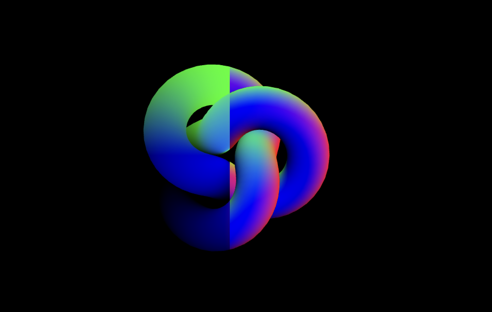

# R3F with GLSL shaders
Offscreen rendering using React Three Fiber and custom GLSL shaders. 

## Getting Started

First, run the development server:

```bash
npm start
```

Open [http://localhost:3000](http://localhost:3000) with your browser to see the demo.

## Preview
